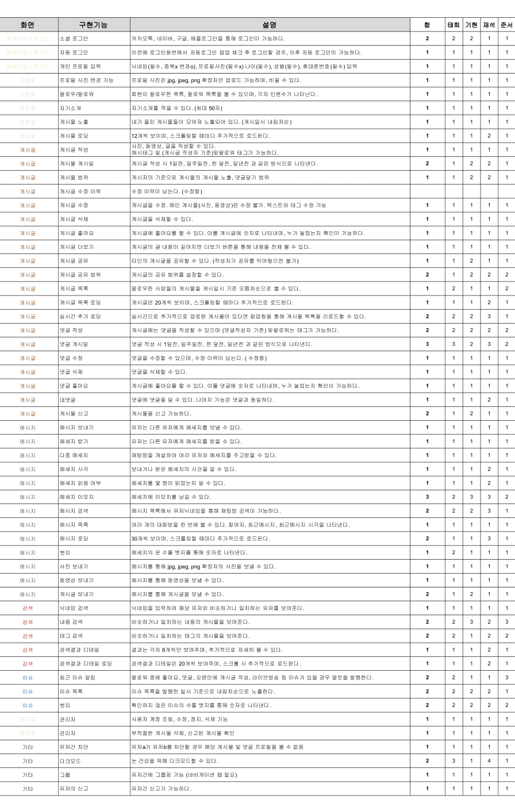
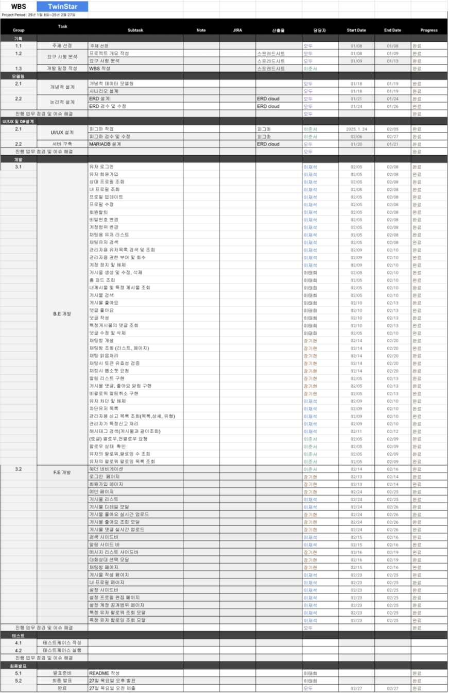
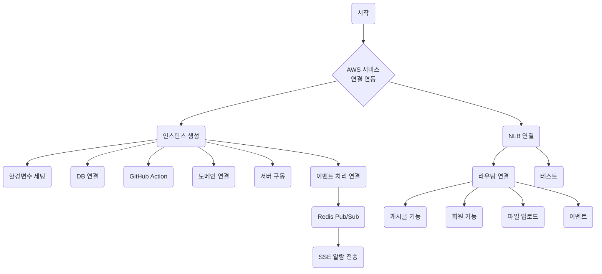
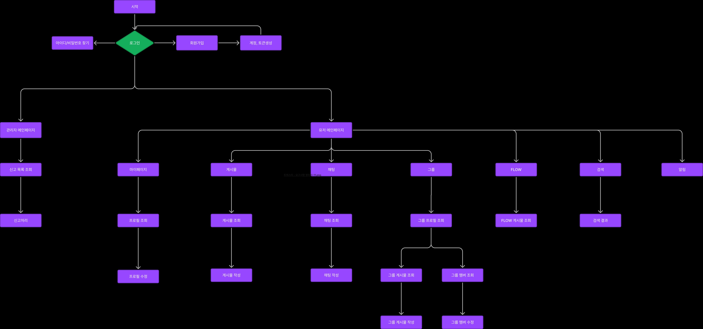
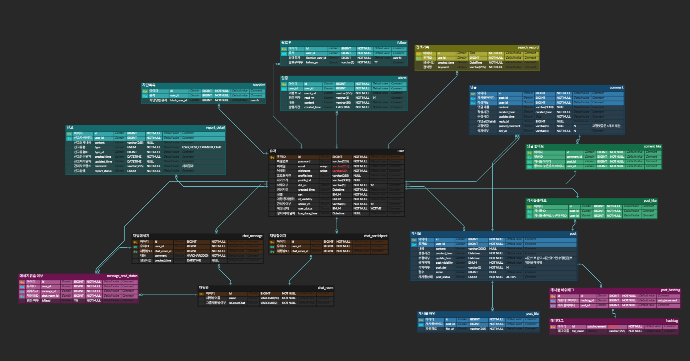
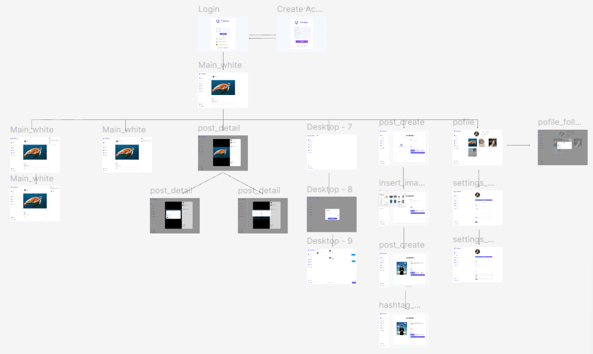
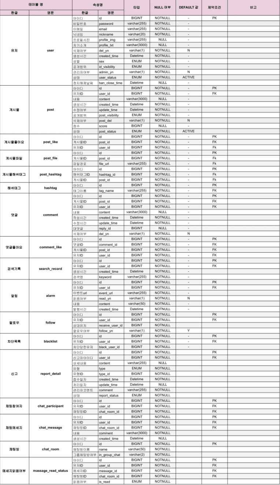

  

  

  

  <strong>Team TwinStar</strong>

|  |  |  |  |
| :---: | :---: | :---: | :---: |
| 팀장 장기현 | 팀원 이재석 | 팀원 이준서 | 팀원 이태희 |

 
 
 

# 프로젝트 개요 

## 1. 프로젝트 주제

**[기본에 집중한 SNS 서비스]**   
일상을 기록하고, 다른 사람들과 공유 할 수 있는 소셜 네트워크 서비스

 

## 2. 프로젝트 소개 
 
TwinStar는 점점 헤비해져가는 SNS들과는 다르게 최소한의 기본적인 서비스에 집중한 SNS 입니다.
사용자 친화적인 인터페이스와 간결한 디자인을 통해, 누구나 쉽게 접근할 수 있는 플랫폼을 제공합니다.
복잡한 기능 대신 핵심 소셜 기능에 집중하여, 진정한 소통의 가치를 전달하고자 합니다.

>

 

 

## 3. 프로젝트 배경 및 필요성

### 3-1. 도파민에 중독된 우리, 디톡스가 필요하다.

  

 
출처. 연합뉴스(https://www.yna.co.kr/view/MYH20240216019500641)
 
 
 
- **쏟아져 나오는 숏폼, 무방비하게 노출되는 우리**
 
 
 
초기 숏폼의 의도는 바쁜 현대인들이 짧은 시간 내에 정보를 주고받고, 빠르게 소통하며 창의적인 표현을 할 수 있도록 한 데에 있었습니다. 
하지만 현재의 숏폼은 의미가 퇴색되어 자극적이고, 상업적인 컨텐츠들이 양산되고 있습니다. 
또한 SNS는 사용자들을 지속적으로 유입시키고, 붙잡아두기 위해 숏폼을 최대한 노출시키는 방향으로 운영되고 있습니다.
   
### 3-2. 전 세계 인구의 60% 이상 SNS 이용 중.. 하루 평균 '150분'
특히 일명 'MZ세대'의 경우 인구의 89% 이상 이용 중 인 것으로 확인 되었으며 평균적으로 2~3시간 가량 이용하며, 3시간 이상 이용 할 경우 일상생활에 지장을 줄 수 있음을 경고하고 있습니다.
 
 
출처.정보통신정책연구원(www.kisdi.re.kr/report/view.do?key=m2101113025790&masterId=4333447&arrMasterId=4333447&artId=1674096) (세대별 SNS 이용 현황)

### 3-3. 그러나 하루 1~2시간의 이용량은 삶의 만족도를 향상시킨다.
너무 과한 사용은 독이 되지만, 적당히 소셜 커뮤니케이션을 활용할 경우 삶의 만족도를 향상시키며 사회성이 증진 될 수 있다는 연구결과에 주목하여 시간이 흐를수록 더욱 헤비해지는 기존의 SNS와는 다르게 라이트하고 기본에 충실한 SNS를 만들게 되었습니다. 

### 3-4. 사용자 중심 서비스 구현
기술적 트렌드에 휩쓸리지 않고, 사용자들의 실제 소통과 편의성을 최우선으로 고려한 플랫폼 구축에 주력합니다.
과도한 정보 노출로 인한 부작용을 최소화하고, 건강한 디지털 커뮤니케이션 문화를 형성하기 위한 노력이 담겨 있습니다.

 

## 4. 프로젝트 주요 기능

### 4-1. 회원가입
기본적인 회원가입 기능입니다.

### 4-2. 로그인
기본적인 로그인 기능입니다.

### 4-3. 회원 정보 수정
자신의 profile을 꾸밀 수 있습니다.

### 4-4. 게시물 등록 및 조회
게시물을 작성 할 수 있고 타인의 게시물을 조회 가능합니다.

### 4-5. 알림기능
자신의 게시물이나 댓글에 이벤트가 발생할 시 실시간으로 알 수 있습니다.

### 4-6. 채팅기능
다른 사용자와 실시간으로 대화 할 수 있습니다.

### 4-8. 태그
사용자의 관심사를 게시물에 간략하게 입력 할 수 있습니다.

### 4-9. 검색
공통된 관심사를 가진 사람들의 게시물을 태그를 검색 함 으로써 찾을 수 있습니다.

### 4-10. 실시간 인기 게시물
현재 TwinStar 내에서 인기있는 게시물을 홈 화면에서 확인 할 수 있습니다.

### 4-11. 신고기능
비정상적인 행위를 하는 이용자를 신고할 수 있습니다.
신고 시 관리자가 확인할 수 있는 신고 목록 페이지에 신고 사항이 등록되고, 관리자 판단 하에 신고를 승인하거나 반려할 수 있습니다.
신고 승인 시 피신고자의 계정은 정해진 기간 동안 정지될 수 있습니다.

 

## 5. 요구사항 명세서

요구사항 정의서

WBS

 

## 6. UML, 플로우차트

UML

플로우차트

 

## 7. ERD

ERD

 

## 8. 화면 설계서

화면 설계서

 

## 9. 테이블 정의서(DDL 쿼리문 포함)

테이블 정의서

 

## 🎮 기술 스택

### BACKEND

### FRONTEND

###  DB

### 협업도구

&nbsp;

 

## 11. 테스트 결과서(테스트 쿼리문 포함)

테스트 케이스 정의서

### 사용자

사용자

회원관리

회원가입(아이디 중복 확인)

###

회원정보조회_아이디

###

회원정보조회_성별

###

관리자 등록 변경

###

회원 정보 변경

###

회원 탈퇴

###

회원 공개 정보 변경

로그인

아이디 정보 조회(디비에 있는 경우)

###

아이디 정보 조회(디비에 없는 경우)

###

비밀번호 교체 주기 확인

### 게시물

게시물

게시물 등록

###

게시물 임시 저장

###

게시물 수정

###

게시물 삭제

###

게시물 조회-인기게시물

.png)

###

게시글 조회-태그

.png)

###

게시글 상세조회

###

좋아요 등록

###

좋아요 삭제

###

댓글 등록

###

댓글 수정

###

댓글 삭제

###

댓글 조회

###

댓글 좋아요 등록

###

댓글 좋아요 삭제

###

대댓글 등록

###

대댓글 좋아요 등록

###

대댓글 좋아요 취소

###

게시글 작성자 프로필 조회

###

댓글 작성자 프로필 조회

### 신고

신고

유저 신고

###

유저 신고 승인

###

유저 신고 반려

###

게시물 신고 

###

게시물 신고 승인 

###

게시물 신고 반려 

###

댓글 신고 

###

댓글 신고 승인 

###

댓글 신고 반려 

###

신고 내역 조회 

###

신고 내역 상세 조회-유저

###

신고 내역 상세 조회-게시물

###

신고 내역 상세 조회-댓글

###

정지 이력 기록

### 알림

알림

알림 템플릿 등록

###

알림 템플릿 수정

###

알림 템플릿 삭제

###

알림 템플릿 조회

###

알림 템플릿 상세조회

###

댓글 작성 알림 발송

 

###

좋아요 알림 발송

 

###

신고 승인 시 알림발송

 

 

## 12. 트러블슈팅
||내용|
|-|-|
|1|쿼리문 작성 과정에서 트리거를 통한 로직 구현에 있어 자동 마감를 구현하고자 하였으나 트리거의 Update문과 DB 접근과 참가자를 수락하기 위한 Insert의 DB 접근이 동시에 일어나는 문제를 해결하지 못해 트리거를 삭제하게 되었습니다. 이부분의 해결을 위해서 충돌을 피하기 위해 트리거 문을 수정하는 작업을 진행했어야 됐던 것 같습니다.|
|2|각자의 PC에서 작업을 하다가 효율성을 위해서 같은 DB서버를 사용하기로 하였을 때, 간단하게 생각했는데 Replication 적용을 하면서 많은 문제를 만나게 되었습니다. Replication을 적용하면 단순히 복제가 되는 것으로 생각을 했는데 Master의 변경 사항을 Slave에 그대로 Slave에 전달하는 구조를 이해하고 나서 해결의 실마리가 보였던 것 같습니다. 이후에 기존에 운영중이던 DB 중 불필요한 서비스를 내리고 추가로 나머지 DB는 Master를 Slave에 복제한 후에 Replication을 적용하여 해결하였습니다.|
|3|프로젝트에서 알림 발송 쪽을 구현하면서 템플릿의 내용에 값들을 변경하여 알림을 발송하고 싶었습니다. 하지만 백엔드 측으로 구현가능한 내용을 데이터베이스로 처리하려다 보니 어려움을 겪었고 트리거와 REPLACE 함수를 이용해 만들어보았는데 그렇게 쿼리를 작성 하다보니 테이블 구조 쪽에 문제가 생겨 정규화가 전혀 진행되지 않은 테이블이 아니고선 구현이 되지 않는 상황을 맞닥뜨렸습니다. 이런 테이블 구조로는 쿼리를 복잡하게 짜서 칭찬을 받기보다 테이블 구조가 문제가 있다는 말을 듣게될 것 같아 강사님께도 질문드려보고 하였습니다. 하지만 데이터베이스 챕터를 한다고해서 꼭 서비스 측면을 데이터베이스로 구현할 필요가 없다는 것을 알아차리고 팀원들과 함께 고민한 끝에 뜻을 맞춰 하드코딩으로 알림 발송 트리거를 만들게되었습니다.|

 

## 13. 팀 회고
|팀원|회고 내용|
|:---:|-|
|장기현||
|이재석||
|이준서||
|이태희||
